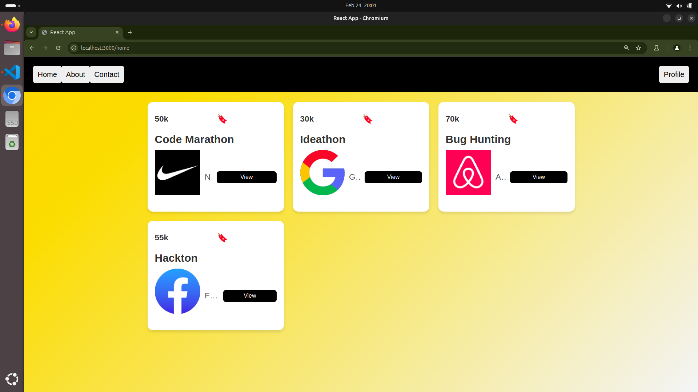
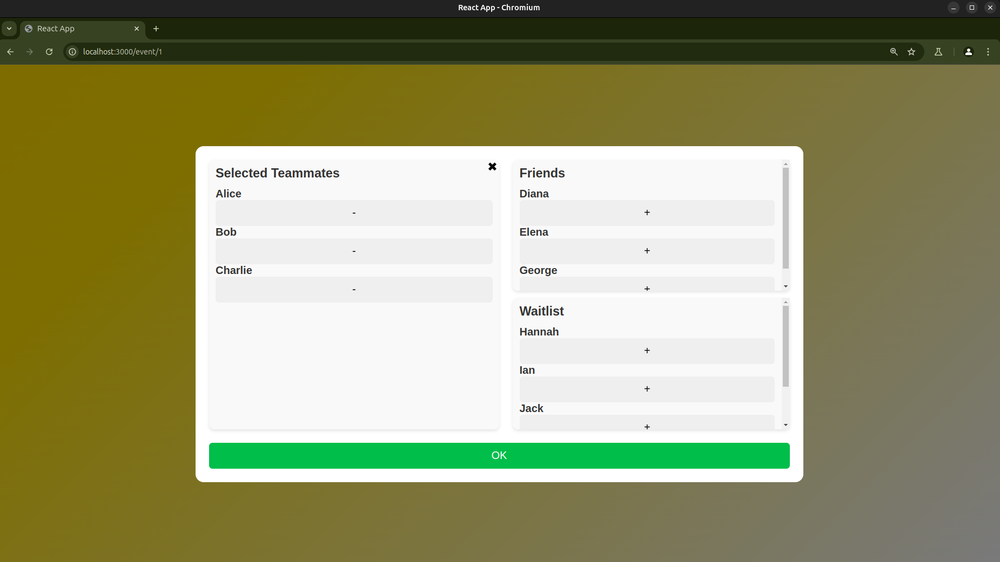
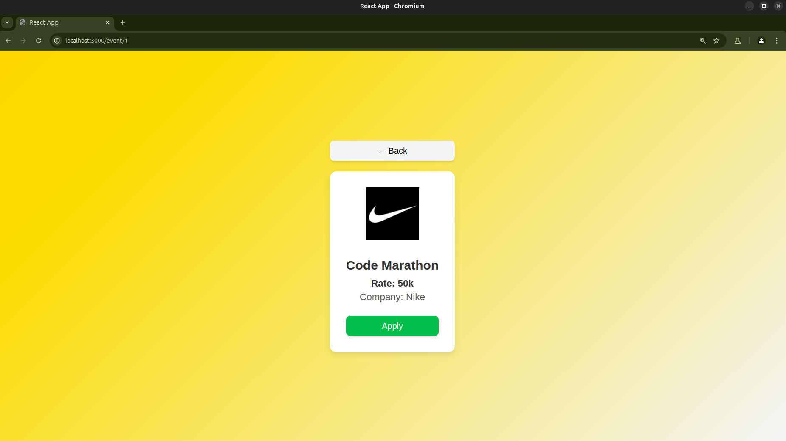

# 🚀 EventHive

EventHive is a full-stack event listing platform where users can browse various tech-related competitions, hackathons, and challenges. The application is built using **React** for the frontend, **Express.js** for the backend, and **MongoDB** as the database.

---
## 🎨 UI Screenshots

### 🔹 Home Page

### 🔹 Add People

### 🔹 Event Details

